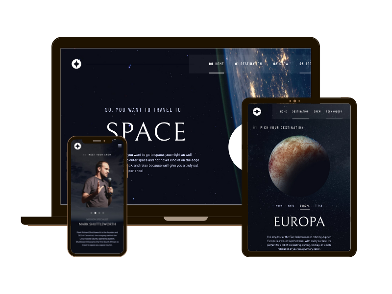

# Space tourism multi-page website

Learn about space exploration in this 12-page fully responsive, interactive and accessible website.

## Frontend Mentor - Space Tourism Multi-page Website Challenge solution

This is a solution to the [Space tourism website challenge on Frontend Mentor](https://www.frontendmentor.io/challenges/space-tourism-multipage-website-gRWj1URZ3). Frontend Mentor challenges help you improve your coding skills by building realistic projects.

## Table of contents

- [Overview](#overview)
  - [The challenge](#the-challenge)
  - [Links](#links)
- [My process](#my-process)
  - [Built with](#built-with)
  - [What I learned](#what-i-learned)
  - [Continued development](#continued-development)
- [Author](#author)
- [Acknowledgements](#acknowledgements)

## Overview

### The challenge

Users should be able to:

- View the optimal layout for each of the website's pages depending on their device's screen size
- See hover states for all interactive elements on the page
- View each page and be able to toggle between the tabs to see new information

### Links

- Solution URL: [Add solution URL here](https://your-solution-url.com)
- Live Site URL: [https://sazbot.github.io/space-tourism-website/](https://sazbot.github.io/space-tourism-website/)

## My process

### Built with

- Semantic HTML5 markup
- CSS utility classes and custom properties
- CSS Grid
- Mobile-first workflow

### What I learned

- How to use a CSS design system to create utility classes and custom properties
- How to use CSS grid responsively across different device sizes
- How to incorporate accessible rich internet applications (ARIA) to enhance accessibility (e.g. roles and attributes)

### Continued development

- Gain further experience in using CSS grid in responsive design
- Continue to incorporate ARIA roles and attributes with a mind to increasing accessibility

## Author

- Website - [Sarah Fielding Smith](https://www.your-site.com)
- Frontend Mentor - [@sazbot](https://www.frontendmentor.io/profile/sazbot)
- Twitter - [@sazbotty](https://www.twitter.com/sazbotty)

## Acknowledgments

Thank you to Kevin Powell for his incredibly helpful course on Scrimba.com; this was invaluable for considering how to enhance accessibility of this site.
